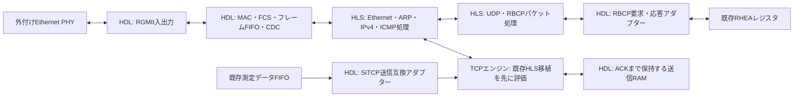

# RHEA向けSiTCP代替の設計案

2026-09-06。単一接続専用RTLを採用し、ARP/ICMPとTCPカウンタ送信の最初の実機試験まで完了した。
測定値と現在の制限は[open_tcp_benchmark.ja.md](open_tcp_benchmark.ja.md)を参照。

## 推奨方針

AXKU042の1 GbEとTCPサーバー1接続に対象を絞り、PHY接続、MAC、ARP、ICMP、IPv4、TCPを独自RTLで実装する。
外部CPU、OS、PCIeホストを必要としない常時動作回路としてVivadoへ組み込む。100 Gbps向けHLS TCPスタックの移植は行わず、HLSは今後、複雑な解析処理でRTLより明確な利点がある箇所に限定して再評価する。

最初の対象は現行ソースのAXKU042/KU040、1 GbE、IPv4、同一サブネット、TCPサーバー1接続、FPGAからPCへの測定データ送信、UDP/RBCP制御とする。PCは通常のTCPソケットで接続する。既存測定データのバイト列とユーザーレジスタマップを維持する。

全SiTCP内部レジスタ、EEPROMイメージ、TCPクライアントモードまでの完全互換は初期目標に含めない。PC側が依存する内部レジスタは調査して互換対象に追加する。初期評価は静的MAC/IP/ポート設定で行い、運用版で必要な設定保存・デフォルト復帰を追加する。10/100 Mbps、IPv6、VLAN、ジャンボフレーム、ルーター越しの運用は後続候補。非対応パケットは検査して破棄し、誤解釈しない。

## リポジトリから確認した条件

- `src/vhdl/sitcp.vhd`が置換境界。外側のポートと200 MHzのユーザー側クロックを維持する。
- `src/AXKU042/axku042_sitcp_core.v`はRGMII入出力、125 MHz送信クロックと90度位相クロック、MDIO、24LC04ブリッジ、SiTCPインスタンスを含む。DDR入出力とクロック生成を分離再利用し、MACとMDIO制御は代替側に必要。
- TCPはpassive openで、受信データ出力は未接続。PCからのTCPペイロードをユーザー回路に渡す機能は不要だが、ACK、FIN、RSTやTCP受信シーケンスの処理は必要。
- `src/vhdl/data_transfer_to_sitcp.vhd`は128 KiB FIFOを2段使用。XCIでも各131072 byte、Standard FIFOを確認。FIFO出力の遅延があるので、FULLをAXIのREADY反転だけで代替しない。
- `src/vhdl/rbcp_transfer_from_sitcp.vhd`はWE/REがHの各クロックで要求をFIFOに書く。ACK待ち中ずっとWE/REを立てる実装は要求を重複させる。1 byteの要求を1回発行し、応答を待つアダプターとする。
- `src/vhdl/iq_reader.vhd`はFIFO満杯時に出力validを抑制し、エラーフラグを保持する。ネットワークの信頼性だけでは全測定サンプルの保存を保証できない。
- 上流FIFOのリセットは`cpu_reset_i`であり、TCP再接続による自動消去とはなっていない。切断後に残ったデータを次の測定へ混入させないため、既存PCソフトの開始・停止手順を確認する。
- READMEにはVivado 2018.3とあるが、この環境では管理されたDocker内のVivado/Vitis 2025.2.1を使う。`amd-vitis-2025.2.1-cli`から起動し、ホストPATH上の旧ツールは実行しない。具体的な運用と基準測定回路は[sitcp_benchmark.ja.md](sitcp_benchmark.ja.md)を参照。

## ブロック構成

内部パケットバスはAXI4-Streamを基本とし、候補幅を64 bit、処理クロックを200 MHzとする。1 GbEに対して処理余裕を確保し、8 bitのMAC境界で幅変換する。幅を広げただけで10 GbE対応が完了するわけではない。HLSのII、メモリポート競合、MAC、PHY、タイミングを別途評価する。

HLSは固定幅整数、固定長メモリ、ストリーム、明示的な状態を使う。ホストから起動するカーネルではなく、`ap_ctrl_none`等による常時動作IPを基本とし、ブロック間をDATAFLOWで接続する。再送RAMは読書き要求・応答のストリームでHDLと接続し、共有配列に複数処理が無制限にアクセスする構成を避ける。採用ツール版でC/RTL協調シミュレーション可能な構造にする。

MAC側ではFCS、プリアンブル、最小フレーム長、IFG、フレーム単位の送信開始を扱う。RXにはREADYを返せないため、満杯時はフレーム全体を破棄して数える。フレームとチェックサムの検証が済む前にRBCP書込みやTCP状態変更を確定しない。TXは送信途中でデータが尽きない単位で蓄える。制御パケットが連続測定送信に埋もれないよう、上限付き優先制御を設ける。

## TCPエンジンの選択

単一接続専用RTLを採用した。ARP/ICMP/TCPのプロトタイプはKU040で配置配線を通り、30秒の連番検査付き実機試験で320.640 Mbpsを得た。
この結果から、最初の運用版も同じ境界で再送、RBCP、RHEA送信FIFOを段階的に追加する。
固定1秒RTOと最古未ACKセグメントの再送は追加済みで、ACK欠落のRTL故障注入と実機速度の回帰試験を通した。
以下の汎用HLS TOE調査内容は、将来10 GbE以上や複数接続が必要になった場合の比較資料として残す。

第一候補として[fpga-network-stack](https://github.com/fpgasystems/fpga-network-stack)のTOE（TCP処理エンジン）を単独評価する。同プロジェクトは10–100 Gbit/s向けで、AXI4-Stream、接続数設定、MSS設定、送信要求・許可・データ転送のAPIを持つ。RHEAにそのまま接続できる実績は今回確認できていない。

評価対象は1接続設定、最小の対応データ幅、送信メモリのBRAMバックエンド、受信データの排出、TCPオプションと再送動作。接続数パラメーターを1にするだけで内部表やメモリが最小化されるとは仮定しない。100G向けVitisシェル全体を導入する必要はない。

採用条件は、KU040対象で合成・配置配線できること、RHEA全体の資源予算に収まること、外部DDR/PCIeへの不可避な依存がないこと、基本TCP相互接続と故障注入試験を通ること。既存RHEAとSiTCPの階層別資源レポートを先に採り、LUT/FF/BRAMとタイミングの具体的な許容値を決める。

移植や縮小の負担が大きい場合は、同じパケット・メモリ・アプリケーション境界で1接続専用エンジンを独立実装する。その場合、TCP接続状態・タイマー・RAM所有権はSystemVerilog、ヘッダー解析・生成・チェックサムはHLSを基本とする。新規TCP実装は正常通信の実演だけで採用せず、以下の検証を完成条件にする。

MACの再利用候補は別に評価する。[verilog-ethernet](https://github.com/alexforencich/verilog-ethernet)は1G MAC等を含むが、上流は保守終了を明記している。後継[Taxi](https://github.com/fpganinja/taxi)は別ライセンス体系なので自動置換しない。導入する場合は対象モジュール、依存関係、ライセンス、コミットを記録する。どちらを採る場合も、これだけでTCPが実装済みとは扱わない。

## 互換性とTCPの完成条件

- SiTCP公式マニュアルの送信規約に合わせ、`TCP_TX_FULL`立上がり後8クロックまでの書込みを吸収する。内部パイプラインやCDC通知遅延の分も加えた余裕でFULLを早めに立てる。
- `TCP_OPEN_ACK`、切断中の書込み、リセット後のバッファ内容を定義し、現行SiTCPと同じ入力列で比較する。
- RBCPはID、コマンド、長さ、アドレス順序、読書き応答、バスエラー、約100 msのACK待ちタイムアウトを仕様と実測で照合する。UDP再送で書込みが再実行され得るため、独自の重複抑制を無条件に入れない。
- 各RBCPバスアクセスのタイムアウト後に遅いACKが次要求へ混入しない規則を決める。TCPとRBCPが互いの応答待ちで停止しない独立キュー構成とする。
- TCPの接続確立、正常切断、片側切断、RST、同じ相手との再接続、古いパケット、シーケンス番号周回を扱う。複数接続要求は既存接続を壊さず拒否する。
- 累積ACK・重複ACK・不正な未来ACK・再送・RTTに基づくRTOとバックオフ・受信ウィンドウ・ゼロウィンドウプローブ・輻輳制御を設計に含める。
- MSSは相手の通知とMTUから決める。MTU 1500、通常のIPv4/TCPヘッダーなら上限1460 byte。TCPオプションが増える場合はペイロードを調整する。小量データはMSSを待ち続けず、上限時間で送る。
- window scaling、SACK、timestamps等は初期に有効化しない選択も可能だが、有効化しない交渉とオプション長の解析を正しく行う。固定20 byteのTCPヘッダーと仮定しない。
- PCからのペイロードは、初期用途では受理・ACKして破棄する方針を基本とする。小さな受信バッファと受信シーケンス管理を設け、範囲外・順不同の処理を明示する。アプリケーション受信ポート不要という理由でTCP RXを省かない。
- Ethernet FCS、IPv4/TCP/UDPチェックサム、パケット長、宛先を検証する。IPv4 UDPのchecksum=0は規約どおり扱う。非対応のIP断片化等を数え、限定したネットワーク範囲の実装であることを明記する。

## メモリと性能の目安

送信データはACKされるまでBRAMリングバッファに保持する。書込み位置、新規送信位置、ACK済み位置を区別し、再送が新しい入力に上書きされないようにする。最初の容量候補は64 KiB、128 KiBも比較する。既存2段FIFOは最初の統合では残し、安定動作後にコピーや容量を整理する。

再送用メモリの目安は `実効byte/s × RTT + 余裕`。100 MB/s、RTT 0.5 msなら50 kB、RTT 1 msなら100 kBになる。64 KiBを選んだ場合にあらゆるRTTで線速を達成できるとはしない。実効スループットは相手の受信ウィンドウ、輻輳ウィンドウ、送信保持容量にも制限される。

取得の停止を吸収するメモリは別途 `測定データbyte/s × 停止時間` で見積もる。既存FIFOの公称合計256 KiBは100 MB/sで約2.62 ms分にすぎず、実際に使える余裕は現在の占有量、FULL閾値、各段の制御で減る。10 msの停止を無欠損で吸収するなら約1 MB以上が必要。この要件でDDR導入の要否を判断する。

初期性能目標案は長いTCP連続転送で100 MB/s以上、実機で現行SiTCPの測定値に近づけること。1 GbEの125 MB/sは物理レートで、測定データの速度ではない。未測定の達成見込みを保証値にしない。

FIFO停止・満杯、フレーム破棄、再送、切断原因、RBCPタイムアウトを観測できるカウンターを用意する。再接続時の既存FIFO残留と、取得中のサンプル停止は、時刻・カウンターとPC側の測定開始手順を含めて検証する。切断をまたいだTCPによる継続配送は保証しない。

## 段階と合格条件

1. **互換仕様と基準測定**：実際に使うPCソフトの版、設定読書き、開始停止、再接続を調査。SiTCP単独試験とRHEA実機でpcap、転送速度、RBCP応答、資源量を採る。必要なデータ率と許容停止時間を記録する。
2. **TCP候補の単独評価**：固定版のHLSツールとKU040を指定してTOEを合成。BRAM接続・TCP接続・再送試験と資源見積もりを行い、移植継続か専用実装かを決定する。
3. **Ethernetと制御経路**：別のテストトップでARP、ping、RBCPによるscratch register読書き。不正フレームでレジスタが変化しないこと、タイムアウト後に復帰することを確認する。
4. **TCPと模擬データ**：カウンターまたはPRBSをPCへ転送し、バイト欠損・重複・順序違反を検査。ACK損失、遅延、重複、順序変更、小MSS、zero window、FIN/RST、再接続を試す。輻輳・RTO動作も確認する。
5. **RHEA統合**：ビルド時にSiTCP版と代替版を選べるようにし、同じPCソフトで制御と測定データ形式を比較。飽和送信中もRBCPが応答し、意図しないデータ混入や黙った欠損がないことを確認する。
6. **運用判定**：配置配線後のタイミング・CDC・資源予算を満たし、24時間以上の連続取得、受信アプリ停止、ケーブル抜き差しを評価。データ消失が起きる条件と観測方法を記録する。

検証はHLS Cシミュレーション、C/RTL協調シミュレーション、RTLのフレーム入力試験、Linuxの実TCPとの実機試験を組み合わせる。cocotb/Scapy等を使う場合も送信側と期待値を同じ実装から生成するだけの試験にはせず、独立したプロトコル検証を用意する。シミュレーション用短縮タイマーと実時間タイマーを分ける。24時間試験だけで全TCP仕様への適合を宣言しない。

## 仕様の参照先

- [SiTCP公式マニュアル](https://www.sitcp.net/doc/SiTCP_eng.pdf)：送信FULL後8クロック、RBCP、設定とユーザーI/F。
- [RFC 9293](https://www.rfc-editor.org/rfc/rfc9293.html)：TCPの状態、シーケンス、ウィンドウ等。
- [RFC 5681](https://www.rfc-editor.org/rfc/rfc5681.html)：TCP輻輳制御。
- [RFC 6298](https://www.rfc-editor.org/rfc/rfc6298.html)：再送タイマー。
- [AMD UG1399: pragma HLS interface](https://docs.amd.com/r/2025.1-English/ug1399-vitis-hls/pragma-HLS-interface)：AXI4-Streamとブロック制御指定。実装時は固定したツール版の文書とも照合する。
- [rhea_comm](https://github.com/groundbird/rhea_comm)：READMEが案内するPCソフト。今回、実運用版のコードと依存機能は未調査。
